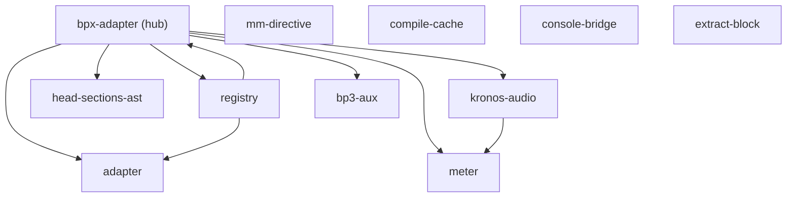

# Bloc « adaptateur » — niveau 2 (intérieur)

> 11 fichiers de code (28 fichiers de test mis de côté). Structure extraite du code ;
> rôles **lus dans l'en-tête de chaque fichier** (pas inventés). `bpx-adapter` est le hub.

## Flux internes

## Rôle de chaque pièce (lu dans le code — à confirmer/corriger)

| Pièce | Rôle (depuis l'en-tête du fichier) |
|---|---|
| **bpx-adapter** | le hub : prend l'arbre BPx, branche tout (utilise les 6 autres) |
| kronos-audio | pilote audio : « Kronos drives the REAL sound (the ONLY engine) » |
| meter | lit la mesure depuis l'autorité BPx — « never invented here » (fix F10) |
| head-sections-ast | lit les sections depuis l'arbre BPScript, plus depuis le texte (fix F11) |
| mm-directive | réécrit la directive de tempo dans la source quand on change le BPM (fix F13) |
| registry | les 7 voix de code (strudel/tidal/hydra/p5/mercury/csound/js) |
| bp3-aux | réglages auxiliaires BP3 pour les grammaires de démo |
| compile-cache | mémoïse la compilation BPScript (plusieurs consommateurs, même scène) |
| **adapter** | ⚠️ pas de doc en tête — rôle à définir |
| **console-bridge** | ⚠️ pas de doc en tête — rôle à définir |
| **extract-block** | ⚠️ pas de doc en tête — rôle à définir |

## À challenger

- **`registry` ↔ `bpx-adapter` se référencent mutuellement** (registry → bpx-adapter ET bpx-adapter → registry). Boucle à confirmer : voulue, ou à casser ?
- **3 pièces sans rôle écrit** (adapter, console-bridge, extract-block) : soit on lit le code pour leur en donner un, soit c'est un signe qu'elles sont mal placées.
