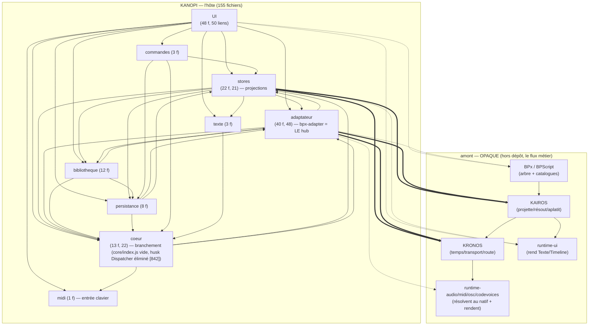
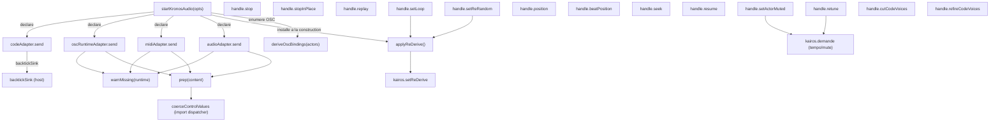

# Carte du réel — Kanopi (l'HÔTE) — phase 1

> **Ce qui EST**, extrait par la machine (dependency-cruiser 18 + `partition.cjs`), pas à la main.
> Médium = dessins ; l'inventaire d'interface est dans le **contrat-DRAFT §3**, pas ici.
> Régénérable : `npm run arch` (garde) + `.dependency-cruiser.cjs` (racine) + `tsconfig.arch.json`.

## Méthode (reproductible)

```
npx depcruise "packages/ui/src/**/*.{ts,svelte}" "packages/core/src/**/*.js" \
  --config .dependency-cruiser.cjs --output-type json > dc.json
node .claude/skills/carto-conformite-archi/partition.cjs dc.json blocks.json
```

- **.ts ET .svelte** parsés (sinon ~40 % des liens manquent). Glob explicite.
- **Frontière du dépôt** : les paquets amont (`@kronos/core`, `@kairos/core`, `bpx`,
  `bp3-frontend`, `runtime-*`) sont résolus en dépôts frères via les deps `file:` ; le garde
  **ne suit PAS dedans** (`doNotFollow`) → ils apparaissent en **boîtes opaques** (le point
  d'entrée que Kanopi touche), jamais dépliés. C'est exactement « Kanopi utilise X » sans entrer
  dans X. Les runtimes minces (`runtime-midi/audio/osc/codevoices`) sont vus via leurs **stubs de
  types locaux** (`src/lib/runtimes/*.d.ts`, mappés par `tsconfig.paths`) — la surface déclarée
  que l'hôte consomme.

## Preuve d'honnêteté — ZÉRO ORPHELIN

```
modules: 209 = code rangé: 155 + données: 51 + ext (svelte/cm/strudel): 3 + NON RANGÉS: 0
flèches CODE: 373 = entre-blocs: 210 + internes: 163   (+ vers données: 97, vers ext: 98)
```

**0 non rangé** : chaque fichier de code Kanopi tombe dans exactement un bloc. Les 51 données
(`*.json`/`*.bps`/`*.gr` : catalogues de langue amont + sessions groupées + routage) et les 3
externes sont comptés, jamais cachés. 46 fichiers de test mis de côté (hors carte).

## Diagramme de blocs (ce qui dépend de qui)

`A → B` = « A utilise B ». **Amont = opaque** (pointillés). Les arêtes **épaisses** = la frontière
hôte↔moteur, le lieu du test de conformité.



> Note de lecture : `ADAPT → BPX` (déplier la dérivation), `ADAPT/STORES ⇒ KAIROS/KRONOS`
> (charger l'arbre, lire la position/les vues), `ADAPT → RTSINKS` (brancher les puits),
> `STORES/UI → RTUI` (monter les vues de production). Ce sont **les seules** sorties de l'hôte
> vers l'aval — pas de court-circuit hôte→sortie repéré (cf. test de conformité).

## Rôle de chaque bloc (lu dans les en-têtes du code, pas inventé)

| Bloc             | Rôle réel                                                                                                                                            | Source amont (projection de…)                    |
| ---------------- | ---------------------------------------------------------------------------------------------------------------------------------------------------- | ------------------------------------------------ |
| **adaptateur**   | branche l'arbre BPx → Kairos → Kronos → puits ; `bpx-adapter.ts` = hub (2115 l.)                                                                     | BPx (arbre), Kairos, Kronos                      |
| **stores**       | projections réactives Svelte (position, acteurs, scènes, vues de prod)                                                                               | Kronos (position), core (acteurs), Kairos (vues) |
| **coeur**        | `core/index.js` (vide — le husk Dispatcher inerte a été éliminé, [842]) + `lib/core*` : branchement runtimes via `runtimes/registry` | scène compilée                                   |
| **UI**           | Svelte 5 + CodeMirror 6 : panneaux, éditeur, monte les vues runtime-ui                                                                               | les stores                                       |
| **bibliotheque** | catalogue de contenu groupé (démos, ressources, starters) pour le navigateur                                                                         | listing réel                                     |
| **persistance**  | espace de travail + fichiers réels (jamais auto-créés)                                                                                               | workspace réel                                   |
| **commandes**    | palette + raccourcis clavier → émettent des commandes                                                                                                | — (UI→moteur)                                    |
| **texte**        | `bar-beat` (format d'affichage) + stub du tokeniseur d'ordre **partagé** (bpscript)                                                                  | Kronos (position)                                |
| **midi**         | entrée clavier MIDI (note-on entrante = saisie utilisateur)                                                                                          | matériel (entrée)                                |

## Familles denses — cartes de fonctions (phase 2, function-diagram)

> Le diagramme de fonctions ne paie que sur l'emmêlé. Les **deux** fichiers de la frontière
> hôte↔moteur sont cartographiés au niveau fonction (rôles lus dans le code) : `bpx-adapter.ts`
> (47 fonctions, le hub) et `kronos-audio.ts` (22 fonctions, le transport audio). Les deux portent
> la complexité **essentielle** du câblage hôte. Le verdict de conformité de chaque sous-rôle est
> dans le **contrat-DRAFT §4.2/§4.3 et §5** ; ici = la photo structurelle.

### A — `bpx-adapter.ts` : le hub runtime (47 fonctions)

Adaptateur de langage BPx (hub runtime de Kanopi). UNE fabrique `makeBpxAdapter` produit deux adaptateurs jumeaux — `bp3Adapter` (.gr) et `bpscriptAdapter` (.bps) — qui ne diffèrent QUE par leur frontal. Chaîne unique : source → frontal → SceneAST → `createSession`/`derive` (BPx) → projection `Kairos.charger` → `startKronosAudio` (routage par acteur sur `event.output`) → sinks MIDI/audio/OSC/code. Le reste (frontaux bp3-frontend/bpscript, moteur BPx, projection Kairos, transport Kronos, runtimes audio/MIDI/codevoices, bibliothèque devices) est consommé tel quel ; l'adaptateur ASSEMBLE et ROUTE. Densité = un `evaluate` de ~640 lignes qui orchestre tout le cycle de vie (eval/produce/step/replay/stop-in-place/hush/dispose) plus l'arm/disarm live des voix. Cycle structurel avec `registry` (le hub doit dispatcher vers ses adaptateurs frères de voix-code, co-enregistrés avec lui).

```mermaid
flowchart TD
  grF["grFrontend (.gr)"]
  bpsF["bpsFrontend (.bps)"]
  pws["parseWithSound"]
  rga["resolveGrAux"]
  sfr["soundFromRef"]
  rss["resolveSeSettings"]
  sfa["soundingFromAst"]
  bo["buildOrchestration"]
  atf["actorTableFromAst"]
  fsa["flagStatesFromAst"]
  mma["mmFromAst"]
  lfa["librariesFromAst"]
  bta["backticksFromAst"]
  btba["btTokenByActor"]
  hsa["headSectionNamesFromAst (externe)"]

  ev["evaluate (HUB ~640 lignes)"]
  wds["withDefaultScene"]
  dsn["defaultSceneName"]
  fs["freshSeed"]
  cs["createSession / derive (BPx)"]
  bm["buildModulators (Kronos)"]
  kch["Kairos.charger"]
  etb["effectiveTempoBpm"]
  bsn["buildSymbolNames"]
  slc["sectionLeafCounts (externe)"]
  pp["publishProduction"]
  sbt["sectionBoundsFromTree"]
  srk["srcKey"]
  gc["getCtx"]
  pc["peekCtx"]
  ldl["loadDeclaredLibraries"]
  rbs["registerBacktickSink"]
  gvd["gateVoiceDevice"]
  vot["voiceOutputType"]
  rfi["runtimeForInterp"]
  rdev["resolveDevice (devices)"]
  ska["startKronosAudio (kronos-audio)"]
  kah["handle kronosAudio (stop/replay/retune/setActorMuted)"]
  rdk["reDeriveKairos (closure boucle)"]
  tdov["tearDownOutgoingVoices"]
  el["emitLifecycle"]
  oafg["onActorsFromGrammar (sink panneau)"]
  ov["map orchestratedVoices (arm/disarm)"]

  reg["import('./registry').getAdapter (DYNAMIQUE)"]
  cva["adapter voix-code .evaluate / .stop"]

  stop["stop (sentinelles stopInPlace/replay/hush/par-clef)"]
  disp["dispose"]
  setbpm["setBpm"]

  grF --> pws
  grF --> hsa
  grF --> bo
  pws --> rga
  pws --> rss
  pws --> sfa
  rga --> sfr
  bpsF --> bta
  bpsF --> fsa
  bpsF --> mma
  bpsF --> lfa
  bpsF --> hsa
  bpsF --> bo
  bo --> atf

  ev --> grF
  ev --> bpsF
  ev --> wds
  wds --> dsn
  ev --> ldl
  ev --> fs
  ev --> cs
  ev --> bm
  ev --> etb
  ev --> kch
  ev --> bsn
  ev --> slc
  ev --> pp
  ev --> srk
  ev --> gc
  ev --> pc
  ev --> btba
  ev --> rbs
  ev --> gvd
  ev --> ska
  ev --> tdov
  ev --> el
  ev --> oafg
  ev --> ov
  pp --> sbt
  gvd --> vot
  gvd --> rdev
  vot --> rfi
  vot --> reg
  rbs --> rfi
  rbs -. "fire-time" .-> reg
  reg --> cva
  ska --> kah
  ska --> rdk
  rdk --> cs
  rdk --> bsn
  rdk --> pp
  ev -. "teardown slots sortants" .-> reg
  tdov -. "stopCode" .-> ov
  ov -. "stopCode/evalCode" .-> reg

  stop --> gc
  stop --> srk
  stop --> el
  stop --> kah
  disp --> kah
  disp --> el
  setbpm --> kah
```



- **makeBpxAdapter** — FABRIQUE du hub : construit un RuntimeAdapter clos sur (id, extensions, frontend), avec son propre EventBus, sa map `voices` (une entrée `BP3Voice` par source — plus de Dispatcher, husk éliminé [842]) et l'enregistrement d'un updater de toggles live. Retourne l'objet {evaluate, setBpm, stop, dispose}. Source unique des deux jumeaux bp3/bpscript.
- **evaluate** — HUB du cycle. Frontal→AST, charge les banques déclarées, sème le seed, dérive via BPx, réconcilie le tempo, construit le registre CV, projette dans Kairos, publie la production, monte le routage par acteur (gate device, sink MIDI, startKronosAudio), enregistre les poignées d'arm/disarm. Gère les modes produce-only (build silencieux) et STEP. Conforme dans l'intention (assemble/route) mais porte BEAUCOUP de décisions hôte (voir natureComplexite).
- **grFrontend** — Frontal .gr : parseWithSound (BP3 natif) → lit sections et orchestration depuis l'AST. Glue de frontal.
- **bpsFrontend** — Frontal .bps : compileToBPxAST puis LIT tout (tempo — voir `mmFromAst` et sa réserve sur `@mm`, flagStates, libraries, backticks, sections, orchestration) DEPUIS l'AST, source unique. Glue de frontal.
- **parseWithSound** — Orchestre le parse .gr à deux passes : parse, apprend les symboles sonnants via resolveGrAux, re-parse. Travail de RÉSOLUTION d'auxiliaires de grammaire côté hôte (délégué à bp3-frontend mais piloté ici).
- **resolveGrAux** — Résout la chaîne d'aux .gr (-al → -so/-mi/-cs) : alphabet + symboles sonnants. Suit alphabetSoundRef, charge et parse les fichiers aux. Résolution de domaine (frontal) portée par l'hôte.
- **soundFromRef** — Charge un texte d'aux par référence et le parse en symboles-sons (parseSoundObjects). Helper de resolveGrAux.
- **soundingFromAst** — Lit les symboles non-notes sonnants depuis actors[0].assignments de l'AST. Lecture de facette.
- **resolveSeSettings** — Résout les réglages moteur -se référencés par la grammaire (charge le texte groupé, laisse parseSeFile interpréter). Résolution de réglage, déléguée.
- **buildOrchestration** — Construit la vue d'orchestration depuis les acteurs de l'AST (table + liste + drapeau synthetic lu de l'AST). Lecture/assemblage de facette, jamais d'acteur 'default' inventé.
- **actorTableFromAst** — Lit chaque ActorDirective → {transport, alphabet, eval}. Lecture de facette.
- **flagStatesFromAst** — Lit les FlagStatesDirective (@flag scene: calm:1…) → table nom→int. Lecture de facette.
- **mmFromAst** — Lit le métronome déclaré @mm depuis les directives. Lecture de facette. ⚠️ `@mm` est une COMPATIBILITÉ D'ENTRÉE BP3, pas la forme BPScript : le compilateur REFUSE `@mm` dans une scène BPScript et renvoie à `@tempo:<N>` (décision Romain 2026-06-26, `BPscript/src/transpiler/parser.js, `parse``). Ce lecteur est en retard sur cette forme — REV-F12.
- **librariesFromAst** — Lit les LibraryDirective (@library.strudel …) → {engine→[ids]}. Lecture de facette.
- **backticksFromAst** — DFS de l'arbre pour les nœuds BacktickInline → {\_btName→{interp,code}}. Lecture de facette (avec garde anti-cycle).
- **btTokenByActor** — DFS : pour chaque Rule, apparie le LHS (nom d'acteur) au token BT de son RHS. Lecture de facette pour l'arm/disarm par voix-code.
- **buildSymbolNames** — Parcourt l'arbre dérivé et résout chaque symbolId via la table de symboles propre du MOTEUR (grammar.symbols.getName). Lit le résolveur du moteur — assemble un index symbolId→nom. Conforme (lit l'autorité), mais construit une structure dérivée côté hôte.
- **sectionBoundsFromTree** — Calcule les bornes temporelles des sections à partir des spans de feuilles de l'arbre (découpe en leafCounts consécutifs). Lecture de l'arbre pour repère VISUEL passif.
- **publishProduction** — Assemble la vue de production complète (tokens ms→s, durée projetée du span racine, bornes de sections, tokens bruts) et la pose dans le store. Inclut un repli equal-split `i*durée/count` = LAYOUT calculé par l'hôte (display-only).
- **effectiveTempoBpm** — Réconcilie le tempo : lit `tree.metadata.tempo` (autorité moteur), repli sur le tempo fourni en entrée. Pur, lit une facette.
- **withDefaultScene** — Injecte la scène par défaut dans les flags quand le .bps a des scènes nommées et que l'appelant n'en a passé aucune. ENCODE la règle de langage 'la scène d'int le plus bas est active par défaut' (décision de domaine côté hôte).
- **defaultSceneName** — Choisit la première scène nommée (int min) de la table de flags. Sert withDefaultScene ET la barre de scènes (source partagée).
- **gateVoiceDevice** — Résout l'appareil (resolveDevice) et vérifie la compatibilité type-voix/type-device AVANT routage ; jette une erreur claire sinon. Résolution de DEVICE explicitement hôte (DEVICES_SPEC) — concerne le routage, pas le domaine musical.
- **voiceOutputType** — Détermine ce que produit une voix : notes (native) ou outputType de l'adaptateur d'interprète (registry, import dynamique). Lecture, déclenche le cycle registry.
- **runtimeForInterp** — Mappe un tag d'interprète au Runtime correspondant via le set dérivé de codeVoiceAdapters. Pas de table à la main.
- **registerBacktickSink** — Construit les closures {isBacktick, sink} que Kronos appelle au moment ordonnancé : le sink résout l'adaptateur d'interprète (registry, import dynamique) et lance le code. PLACE en temps une voix déjà validée ; ne compose/rend rien lui-même.
- **loadDeclaredLibraries** — Charge les banques d'échantillons déclarées par moteur (@library.strudel via findBank/loadSampleBank), fire-and-forget, erreurs loggées. Câblage de chargement.
- **tearDownOutgoingVoices** — Arrête et oublie chaque voix-code orchestrée d'un AUTRE fichier que celui qui évalue (await stopCode). Nettoyage de cycle de vie cross-fichier.
- **armOrchestratedActor** — Ré-arme une voix orchestrée (un-mute notes + re-eval code). Lit la poignée live.
- **disarmOrchestratedActor** — Désarme une voix orchestrée (mute notes + stop code). Lit la poignée live.
- **isOrchestratedActor** — Teste si un nom est une voix orchestrée live (sélection de chemin par le cœur).
- **setBpm** — Met à jour currentBpm (grille STEP de la PROCHAINE dérivation) et retune chaque voix vivante via sa poignée Kronos, sans re-dériver. Reçu par les deux fan-out tempo (user + scène) ; n'enregistre jamais userTempo.
- **stop** — Cycle de vie d'arrêt à sentinelles : **stop_in_place** (tête à 0, handle gardé), **replay** (réveille le contexte, rejoue les handles 'stopped'), **hush** (tout couper + vider les maps + cursor/feed à null), sinon arrêt par clef. Aucune résolution, pure orchestration de transport.
- **dispose** — Arrête toutes les voix, vide la map, remet cursor/feed à null. Cycle de vie.
- **emitLifecycle** — Émet un évènement trigger eval/stop sur le bus de l'adaptateur. Notification.
- **getCtx** — Accesseur d'AudioContext partagé qui REPREND le contexte (await resume) — un play est un geste utilisateur. Câblage audio.
- **peekCtx** — Accesseur d'AudioContext SANS reprise — un produce/load ne réveille pas l'audio (Model C build silencieux). Câblage audio.
- **pauseAudioContext** — Suspend le contexte audio partagé (vraie pause WebAudio sans démonter les dispatchers). Câblage transport.
- **resumeAudioContext** — Reprend le contexte audio suspendu. Câblage transport.
- **srcKey** — Clef d'une source : actorId sinon fileId. Helper trivial.
- **freshSeed** — Tire un seed LCG aléatoire (1..0x7ffffffe). Glue de re-random (champ de config BPx documenté, pas un portage de RNG).
- **setUserTempo** — Enregistre le tempo tapé/typé par l'utilisateur (seul tempo légitimement hôte, D10). Le canal tempo de scène ne passe pas par là.
- **setResumeBeat** — Mémorise l'offset de reprise (Step→Play), consommé une fois par le prochain evaluate non-STEP.
- **setTempoSink / setMeterSink / setActorsSink / setExprSource** — Branchent les hooks optionnels (clock.setBpm, time signature, panneau acteurs, factory expr de runtime-audio). Câblage de sinks ; setExprSource est appelé au chargement du module pour passer la factory CV de runtime-audio (l'hôte ne compile/rend pas le CV).
- **setReRandomLive / setLoopLive** — Poussent les toggles loop/re-random sur les voix en cours via les updaters enregistrés. Câblage transport live.
- ****getBpxDeriveCount / **getUserTempo / \_\_getCurrentBpm** — Instrumentation de preuve (Model C / F06-F07) : exposent l'état du module aux tests. Hors API runtime.
- **reDeriveKairos (closure dans evaluate)** — Closure de bord de boucle : re-dérive avec un seed frais (re-roll des règles random/pondérées), re-charge Kairos (bump de génération → re-pull Kronos) et re-publie la production. Réutilise createSession/buildSymbolNames/publishProduction.

**Nature :** ESSENTIELLE (assemblage/câblage inévitable de l'hôte) : la bifurcation des deux frontaux .gr/.bps convergeant sur un AST unique ; la chaîne dérive→projection Kairos→routage Kronos par acteur ; le montage du routage (gate device, sink MIDI lifecycle, enumération OSC, sink backtick) ; le cycle de vie complet (eval/produce-only build silencieux/STEP/replay/stop-in-place/hush/dispose) et l'arm/disarm live par voix. Tout cela est du wiring host légitime, prouvé par le graphe : `evaluate` est un orchestrateur à fan-out, il APPELLE les autorités (BPx, Kairos, Kronos, devices) sans réimplémenter leur logique.

TANGLE ACCIDENTEL : le cycle bpx-adapter↔registry. `registry.ts` importe STATIQUEMENT bp3Adapter/bpscriptAdapter (lignes 7,11-12) ; en retour, bpx-adapter doit dispatcher vers ses adaptateurs FRÈRES de voix-code, co-enregistrés dans le MÊME registre. Symptômes dans le code : 5 imports DYNAMIQUES `await import('./registry')` (voiceOutputType, sink de registerBacktickSink, teardown des slots sortants dans evaluate, stopCode et evalCode des poignées) uniquement pour casser le cycle d'évaluation de module ; et `codeVoiceRuntimes` dérivé de `codeVoiceAdapters` importé de runtime-codevoices PLUTÔT que du registre, commentaire explicite « avoids the bp3 ↔ registry module-eval cycle ». Couplage évitable : le dispatch vers les voix-code pourrait être INJECTÉ dans la fabrique (dépendance descendante) au lieu d'être auto-recherché dans le registre qui contient déjà l'adaptateur lui-même.

NON-CONFORMITÉS au principe dur (l'hôte ne résout/compose/rend rien, ne porte pas la data du domaine) :

1. C1 — DATA DE DOMAINE DANS L'HÔTE : `PITCH_LIB` (constante hôte qui agrège les 5 catalogues musicaux bpscript/lib) et `WESTERN_NOTES = ['C'..'B']` (alphabet musical occidental codé dans l'hôte, servant de fallback de parse .gr). PITCH_LIB est rationalisé par le design (passé à Kairos comme `ctx.pitchLib`, l'hôte « gatekeeper de fraîcheur » LAN-14, résout rien) mais c'est bien l'hôte qui PORTE la data du domaine. WESTERN_NOTES est un défaut musical hôte (atténué : passé comme fallbackAlphabet, le frontal sniffe sinon). NB : `DIGITAL_LIB` (= `LIBS.digital` du bundle bpscript, fonctions digitales body-full) suit le MÊME patron légitime que pitchLib — l'hôte FOURNIT la lib (3 provenances), Kairos APPLIQUE le transpose à la projection (KAI-B03) ; l'hôte n'exécute aucune fonction (porter≠résoudre).
2. RÉSOUT (frontal) : parseWithSound/resolveGrAux/soundFromRef/resolveSeSettings — l'hôte PILOTE la résolution multi-passe des auxiliaires de grammaire .gr (alphabet, symboles sonnants, réglages moteur), suit alphabetSoundRef, charge et parse. Logique déléguée à bp3-frontend mais l'orchestration de résolution vit ici.
3. COMPOSE : l'appel `buildModulators(ast.cvInstances, modLibJson)` dans evaluate construit le registre de modulateurs CV — fonction en forme de composition (commentaire : « fuses the scene's cv declarations with the mod library »). Atténué : c'est une fonction de @kronos/core consommée telle quelle, et c'est la projection Kairos qui COMPOSE les liaisons au flatten ; l'hôte assemble seulement les entrées.
4. CALCUL D'AFFICHAGE/HORLOGE par l'hôte (mineur, display/transport) : `publishProduction`/`sectionBoundsFromTree` calculent les bornes de sections (repli equal-split `i*durée/count` inventé par l'hôte) ; `beatDurSec = 60/currentBpm` et l'état module currentBpm/sceneBeatsPerBar/userTempo = arithmétique d'horloge/grille STEP côté hôte (justifiée par D10 mais c'est du calcul) ; `withDefaultScene` encode la règle de langage « scène d'int min = défaut ».
   Aucun rendu sonore/visuel n'est fait par l'hôte (sinks audio/CV délégués à runtime-audio/Kronos, voix-code à leurs adaptateurs) — la frontière de rendu est respectée. Les manquements réels sont C1 (catalogues+alphabet portés) et la résolution d'aux .gr pilotée par l'hôte.

### B — `kronos-audio.ts` : la frontière transport audio (22 fonctions)

> ⚠️ **PÉRIMÉ, non réécrit dans cette passe (hors mandat purge Dispatcher).** Cette
> famille B (diagramme + prose ci-dessous, y compris `COERCE`/`prep`/`coerceControlValues`
> et les fonctions `getCtx`/`peekCtx`/`pauseAudioContext`/`resumeAudioContext` citées en
> §A) décrit un état antérieur à la migration « la sortie audio quitte l'hôte » : le fichier
> réel (`kronos-audio.ts:391-437`) indique explicitement « Plus de `warnMissing` ni de
> `prep`/coerce hôte » et ces fonctions/`audioAdapter`/`midiAdapter`/`oscRuntimeAdapter` sont
> absentes du code actuel (vérifié par grep). Distinct de la purge Dispatcher [842] traitée
> ici — nécessite un audit/re-cartographie dédié.

Frontière hôte↔moteur côté transport audio (`packages/ui/src/lib/runtimes/kronos-audio.ts`). Deux fonctions de module (deriveOscBindings, startKronosAudio) ; startKronosAudio est un GROS builder qui (1) assemble la machine Kronos sur l'horloge AudioContext partagée, (2) construit ou récupère les sinks de sortie (audio/MIDI/OSC/code), (3) déclare 5 RuntimeAdapters qui reshapent chaque ScheduledEvent vers la forme attendue par le sink, (4) câble Kronos↔Kairos (bindStructureSource, setReDerive) et (5) retourne un handle de ~16 closures projetant les commandes transport + lifecycle Model C. Toute la logique réelle vit dans des closures internes (prep, warnMissing, applyReDerive, les .send d'adaptateurs, les méthodes du handle).



- **deriveOscBindings(actors)** — Helper PUR de module. Énumère la table actor→output (metadata.actors, autorité BPx) et en extrait les acteurs runtime==='osc' avec device/channel, pour le pré-fetch des surfaces OSC (setBindings). Ne choisit aucun binding ; le device/channel par-événement voyage sur event.output. CONFORME (lecture+projection d'une facette).
- **startKronosAudio(opts)** — Builder/orchestrateur de la frontière. Calcule les modes (step/buildOnly/loop/startScene), crée la timeline placeholder, l'InternalClock sur audioCtx, l'AudioRuntime, monte (ou non, gating buildOnly) le socket OSC, déclare les 5 adaptateurs, instancie Scheduler+Cursor+Transport+RealtimeDriver, bind la StructureSource de Kairos, branche les modes (buildOnly/step/play), puis retourne le handle. Complexité ESSENTIELLE d'assemblage hôte — mais c'est aussi le lieu des micro-non-conformités (voir prep/adaptateurs).
- **warnMissing(runtime) [closure]** — Garde-fou anti-drop silencieux : journalise une fois par runtime l'absence de sink. Conforme (diagnostic, jamais de reroutage).
- **prep(content) [closure]** — Pré-traitement du contenu d'événement AVANT envoi. Appelle coerceControlValues (coercition string-numérique→nombre), SUPPRIME les contrôles dont la valeur est un objet (descripteurs CV — 'modulation pilotée par content.modulations'), et calcule velRaw avec repli sur rq.vel. NON-CONFORMITÉ MINEURE : l'hôte massage/élague la donnée de domaine (contrôles, vel) au lieu de la transmettre verbatim — composition légère côté hôte.
- **audioAdapter.send(ev) [closure]** — Mappe ScheduledEvent→forme AudioRuntime. Forwarde la facette pitch VERBATIM (conforme, KAI-10) mais CALCULE velocity = velRaw/127 (conversion d'unité MIDI 0..127→0..1). NON-CONFORMITÉ MINEURE : l'hôte effectue une conversion numérique sur une valeur de domaine (rendu/normalisation).
- **midiAdapter.send(ev) [closure]** — Mappe ScheduledEvent→événement plat MIDI (token+controls+durSec, chan depuis ev.output.channel). Forwarde pitch verbatim (conforme). Même velocity=velRaw/127 que l'audio. NON-CONFORMITÉ MINEURE identique (conversion d'unité côté hôte).
- **oscRuntimeAdapter.send(ev) [closure]** — Mappe ScheduledEvent→payload OSC (token+controls coercés+pitch+modulations), output rid through. C'est le profil OSC du runtime qui résout les adresses. CONFORME pour l'essentiel (pas de velocity/127 ici), hérite de la coercition/élagage de prep.
- **codeAdapter.send(ev) [closure]** — Route une voix de code (output.runtime==='code') vers le backtickSink avec startSec/durSec/absTime et l'interpréteur lu sur ev.output.device. Pas de stop() (les voix de code sont host-managed). Conforme (routage pur).
- **applyReDerive() [closure]** — Arme/désarme le re-derive sur Kairos (setReDerive) selon reRandomActive ⊗ loopActive. Câblage de la porte loop-edge ; ne dérive rien lui-même. Conforme.
- **handle.stop() [closure]** — Teardown complet one-shot (flag stopped) : transport.stop()+driver.stop()+oscAdapter.close(). Ne coupe PAS les voix de code (re-eval même fichier). Conforme (projection lifecycle).
- **handle.stopInPlace() [closure]** — Model C — stop rejouable : transport.stop()+driver.stop()+oscAdapter.stop() (socket gardé) + stopCodeVoices(). Conforme.
- **handle.replay() [closure]** — Model C — rejoue depuis 0 : transport.play()+driver.start()+refireCodeVoices(). Zéro re-dérivation. Conforme.
- **handle.cutCodeVoices() [closure]** — Délègue stopCodeVoices() (PAUSE-cut host-managed). Conforme.
- **handle.refireCodeVoices() [closure]** — Délègue refireCodeVoices() (RESUME). Conforme.
- **handle.setReRandom(on) [closure]** — Met à jour reRandomActive puis applyReDerive(). Conforme (transmission de bouton).
- **handle.setLoop(on) [closure]** — Met à jour loopActive, scheduler.setLoop+cursor.setLoop, puis applyReDerive(). Conforme.
- **handle.position() [closure]** — Lit la position scène depuis le Transport (exception STEP→fromSec). Aucun compteur hôte. Conforme (lecture d'autorité Kronos).
- **handle.beatPosition() [closure]** — Lit le readout bar/beat depuis le Transport/cursor (exception STEP). Conforme.
- **handle.seek(sceneSec) [closure]** — Re-ancre clock.start+scheduler.start au même sceneSec. Conforme (commande projetée).
- **handle.resume(sceneSec) [closure]** — Reprise en place : scheduler.setSceneBound(null)+clock.start+scheduler.start+driver.start. Conforme.
- **handle.retune(bpm) [closure]** — Tempo live via la porte d'écriture unique Kairos (demande type:'tempo', quand:'immediat'). L'hôte ne ré-ancre PAS l'horloge lui-même. Conforme exemplaire.
- **handle.setActorMuted(actor, muted) [closure]** — Mute/arm acteur via Kairos.demande (type:'mute', immediat). Conforme exemplaire.

**Nature :** Famille MAJORITAIREMENT à complexité ESSENTIELLE : c'est le câblage inévitable de l'hôte. Le graphe d'appel le prouve — un builder unique (startKronosAudio) qui assemble la machine Kronos (clock/scheduler/cursor/transport/driver) sur l'horloge AudioContext partagée, déclare 5 adaptateurs purement routeurs (sélection par event.output.runtime, AUCUN adaptateur par défaut), et projette des commandes vers Transport/Kairos via des closures fines. Les chemins exemplaires de conformité : retune et setActorMuted passent par la porte d'écriture unique kairos.demande (l'hôte ne ré-ancre jamais l'horloge ni n'écrit l'arbre lui-même) ; la facette pitch est forwardée VERBATIM dans les 3 adaptateurs note (KAI-10 — l'hôte ne résout plus le token→Hz). Pas de cycle bpx-adapter↔registry ici : ce fichier n'importe aucun registry (le tangle accidentel cité est ailleurs).

TANGLE ACCIDENTEL (évitable) : le montage du socket OSC inline dans startKronosAudio (new WebSocket + listeners error/close + flag oscErrLogged + try/catch + setBindings().catch) couple l'hôte aux détails de cycle de vie WebSocket/CloseEvent qui appartiennent plutôt à runtime-osc/browser. Glue défendable (besoin de logger un relais injoignable), mais c'est du code transport dans le builder.

NON-CONFORMITÉS au principe dur (l'hôte qui compose/rend / porte la donnée de domaine = C1), toutes MINEURES mais réelles, localisées dans prep + 2 adaptateurs :

1. velocity = velRaw/127 (audioAdapter.send ET midiAdapter.send) : l'hôte CALCULE une conversion d'unité MIDI 0..127 → 0..1 sur une valeur de domaine. C'est du rendu/normalisation, pas de la transmission verbatim.
2. prep() : (a) coerceControlValues coerce les contrôles string→nombre (transformation de donnée de domaine, certes réutilisée AS-IS du dispatcher) ; (b) suppression des contrôles à valeur-objet (descripteurs CV) — l'hôte prend une décision de contenu (« la modulation passe par content.modulations ») ; (c) repli velRaw sur rq.vel — choix de source de domaine. L'hôte massage le payload au lieu de le router tel quel.
   Verdict : assemblage essentiel conforme dans l'ossature (lecture de facettes + câblage + routage + projection des commandes), résidu de composition/rendu à pousser côté moteur/runtime — surtout la conversion vel/127 et l'élagage des contrôles dans prep, qui devraient être faits par les sinks/Kairos, pas par la frontière hôte.

## À challenger (relecture Romain — le sémantique, pas le structurel)

- Les rôles ci-dessus viennent des **en-têtes de fichiers** (faillibles) → à valider.
- « Zéro orphelin » prouve la **partition**, pas la **conformité** : les écarts sont dans le
  contrat-DRAFT §5.
