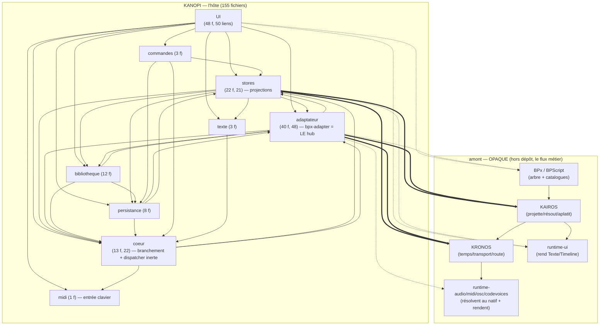

# Carte du réel — Kanopi (l'HÔTE) — phase 1

> **Ce qui EST**, extrait par la machine (dependency-cruiser 18 + `partition.cjs`), pas à la main.
> Médium = dessins ; l'inventaire d'interface est dans le **contrat-DRAFT §3**, pas ici.
> Régénérable : `npm run arch` (garde) + `.dependency-cruiser.cjs` (racine) + `tsconfig.arch.json`.

## Méthode (reproductible)

```
npx depcruise "packages/ui/src/**/*.{ts,svelte}" "packages/core/src/**/*.js" \
  --config .dependency-cruiser.cjs --output-type json > dc.json
node .claude/skills/carto-conformite-archi/partition.cjs dc.json blocks.json
```

- **.ts ET .svelte** parsés (sinon ~40 % des liens manquent). Glob explicite.
- **Frontière du dépôt** : les paquets amont (`@kronos/core`, `@kairos/core`, `bpx`,
  `bp3-frontend`, `runtime-*`) sont résolus en dépôts frères via les deps `file:` ; le garde
  **ne suit PAS dedans** (`doNotFollow`) → ils apparaissent en **boîtes opaques** (le point
  d'entrée que Kanopi touche), jamais dépliés. C'est exactement « Kanopi utilise X » sans entrer
  dans X. Les runtimes minces (`runtime-midi/audio/osc/codevoices`) sont vus via leurs **stubs de
  types locaux** (`src/lib/runtimes/*.d.ts`, mappés par `tsconfig.paths`) — la surface déclarée
  que l'hôte consomme.

## Preuve d'honnêteté — ZÉRO ORPHELIN

```
modules: 209 = code rangé: 155 + données: 51 + ext (svelte/cm/strudel): 3 + NON RANGÉS: 0
flèches CODE: 373 = entre-blocs: 210 + internes: 163   (+ vers données: 97, vers ext: 98)
```

**0 non rangé** : chaque fichier de code Kanopi tombe dans exactement un bloc. Les 51 données
(`*.json`/`*.bps`/`*.gr` : catalogues de langue amont + sessions groupées + routage) et les 3
externes sont comptés, jamais cachés. 46 fichiers de test mis de côté (hors carte).

## Diagramme de blocs (ce qui dépend de qui)

`A → B` = « A utilise B ». **Amont = opaque** (pointillés). Les arêtes **épaisses** = la frontière
hôte↔moteur, le lieu du test de conformité.



> Note de lecture : `ADAPT → BPX` (déplier la dérivation), `ADAPT/STORES ⇒ KAIROS/KRONOS`
> (charger l'arbre, lire la position/les vues), `ADAPT → RTSINKS` (brancher les puits),
> `STORES/UI → RTUI` (monter les vues de production). Ce sont **les seules** sorties de l'hôte
> vers l'aval — pas de court-circuit hôte→sortie repéré (cf. test de conformité).

## Rôle de chaque bloc (lu dans les en-têtes du code, pas inventé)

| Bloc             | Rôle réel                                                                                                                                            | Source amont (projection de…)                    |
| ---------------- | ---------------------------------------------------------------------------------------------------------------------------------------------------- | ------------------------------------------------ |
| **adaptateur**   | branche l'arbre BPx → Kairos → Kronos → puits ; `bpx-adapter.ts` = hub (2115 l.)                                                                     | BPx (arbre), Kairos, Kronos                      |
| **stores**       | projections réactives Svelte (position, acteurs, scènes, vues de prod)                                                                               | Kronos (position), core (acteurs), Kairos (vues) |
| **coeur**        | `core/index.js` + `lib/core*` : registry d'adaptateurs + dispatcher **inerte** (structure de transports lue par Kronos, jamais démarrée pour le son) | scène compilée                                   |
| **UI**           | Svelte 5 + CodeMirror 6 : panneaux, éditeur, monte les vues runtime-ui                                                                               | les stores                                       |
| **bibliotheque** | catalogue de contenu groupé (démos, ressources, starters) pour le navigateur                                                                         | listing réel                                     |
| **persistance**  | espace de travail + fichiers réels (jamais auto-créés)                                                                                               | workspace réel                                   |
| **commandes**    | palette + raccourcis clavier → émettent des commandes                                                                                                | — (UI→moteur)                                    |
| **texte**        | `bar-beat` (format d'affichage) + stub du tokeniseur d'ordre **partagé** (bpscript)                                                                  | Kronos (position)                                |
| **midi**         | entrée clavier MIDI (note-on entrante = saisie utilisateur)                                                                                          | matériel (entrée)                                |

## Familles denses à creuser en phase 2 (function-diagram)

Le diagramme de fonctions ne paie que sur l'emmêlé. Cibles :

1. **`adaptateur` / `bpx-adapter.ts`** (2115 lignes, hub à 48 liens internes, boucle
   `bpx-adapter ↔ registry`) = **LA frontière hôte↔moteur**. C'est là que vivent les wirings de
   résolution/composition (cf. §5 du contrat-DRAFT, écart C1). À zoomer.
2. **`kronos-audio.ts`** (câblage scheduler + sinks + freeze/resume) = second fichier dense de la
   frontière, couplé au hub.
3. `stores` (22) et `UI` (48) sont **volumineux mais plats** (projections / composants 1-à-1) :
   pas de function-diagram sauf si la confrontation l'exige.

## À challenger (relecture Romain — le sémantique, pas le structurel)

- Les rôles ci-dessus viennent des **en-têtes de fichiers** (faillibles) → à valider.
- « Zéro orphelin » prouve la **partition**, pas la **conformité** : les écarts sont dans le
  contrat-DRAFT §5.
