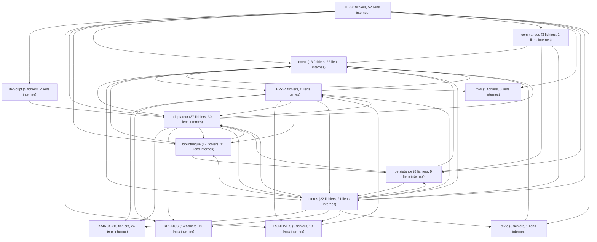

# Flux réel de Kanopi — carte complète (extrait du code)

> **Preuve d'honnêteté (zéro orphelin)** : 248 modules lus = **196 de code, TOUS rangés dans un bloc**
> + 48 fichiers de données + 4 librairies extérieures + **0 non rangé**.
> Flèches entre code : **441 = 236 entre-blocs + 205 internes** (toutes classées).
> Chaque bloc indique (nb fichiers, nb liens internes) — le matériau pour zoomer au niveau suivant.
> Une flèche A → B = « A utilise B ».

## À challenger (ton rôle)

- Les flèches **entre les blocs de Kanopi** (UI, stores, adaptateur, cœur, persistance…) sont fiables.
- Les flèches **impliquant les paquets amont** (BPx, KRONOS, KAIROS, RUNTIMES) sont à confirmer :
  l'outil suit les paquets liés et la frontière devient floue (ex. `BPx → stores` paraît à l'envers).
  Correctif simple si tu veux : traiter les paquets amont comme **opaques** (on note « Kanopi utilise X »
  sans entrer dedans). Je ne tranche pas — toi tu dis ce qui est juste, ça devient une règle.
