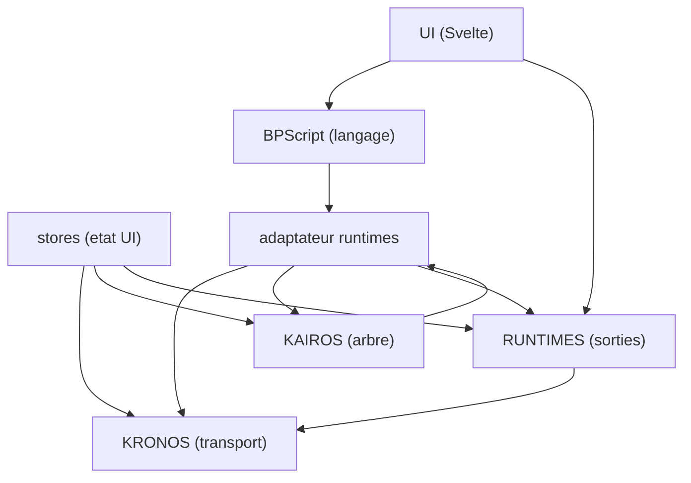

# Flux réel de Kanopi — extrait du code

> ⚠️ **PARTIEL** : généré à partir des seuls fichiers `.ts` (~60 % du code). Les `.svelte` ne sont
> pas encore lus → ~40 % des liens manquent. À refaire en complet (zéro orphelin) une fois la
> lecture `.svelte` en place. Une flèche A → B = « A utilise B ».

## A challenger

Deux fleches paraissent a l'envers (l'amont qui depend de l'hote) :
BPScript -> adaptateur, et KAIROS -> adaptateur. A confirmer une fois les .svelte lus.
