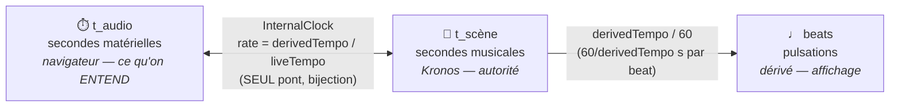
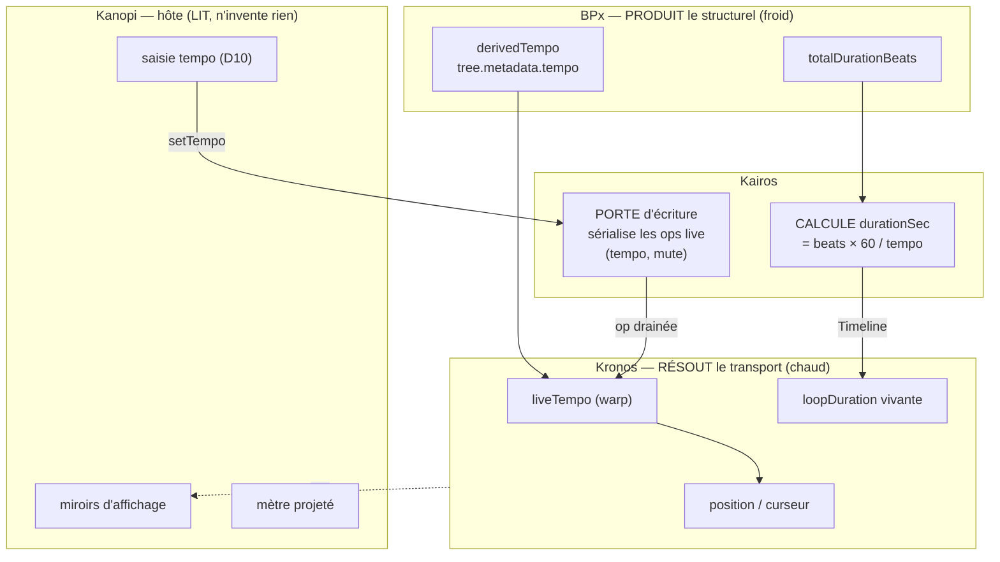
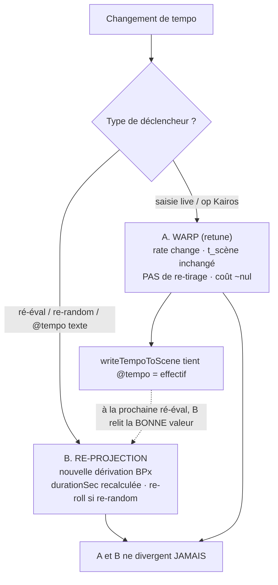

# Horloge & tempo — carte de cohérence cross-repo

> **But.** Le temps traverse **cinq dépôts** et **trois systèmes de coordonnées** qui
> s'entrecroisent (temps-audio, temps-scène, beats). Ce document est la **référence unique**
> de « qui possède quelle horloge, en quelle unité, et comment un tempo circule de bout en
> bout ». Il sert à vérifier la cohérence de toute interaction touchant le temps AVANT de
> coder — comme `TRANSPORT_BEHAVIOR.md` sert de cahier de comportements.
>
> **Statut.** Carte du réel (sur pièces, `fichier:ligne` vérifiés 2026-07-01). Produit par
> l'hôte (Kanopi), **revu et corrigé par l'architecte** (2026-07-01 : revue adversariale vs
> SOTA + constitution — chemin réel du retune §5.2, portée du trou @tempo §5.1, deux casquettes
> de Kairos §3, risques permanents §10, schémas). **À ratifier par Romain.** La partie cross-repo
> (§3 autorités, §8 frontières, §9 invariants) est **promue au hub** en contrat ratifié ligne par
> ligne (chaque propriétaire ratifie sa ligne) ; ce fichier reste la **référence humaine** (schémas
> + pédagogie), le hub porte le **contrat opposable**.
>
> **Supersède / corrige.** `PLAYBACK_LOOP.md` et `TEMPORAL_INTERPRETER.md` décrivent l'ANCIEN
> chemin (`MockClock`, `Dispatcher.musicalBeatPosition`, `_loopOffset`) remplacé par Kronos —
> les parties horloge de ces deux docs sont **périmées**, ce document fait foi pour le réel.

---

## 0. Loi fondatrice (rappel)

Le temps, la position et l'état de transport **appartiennent à Kronos**
(`hub/contrats/kronos-transport.md`). Kanopi **émet des commandes** (`play/pause/stop/step/
seek/setTempo/setLoop`) et **lit** l'état observable ; il ne tient ni compteur de position ni
2ᵉ machine d'état. Tout ce que l'hôte *fabrique* en matière de temps est un bug.

Décision cadre (2026-06-29) : le **tempo est un contrôle de TRANSPORT → Kronos** (« le chaud,
sans re-projection »). Seul le **structurel** (rechargement de l'arbre) passe par Kairos.

---

## 1. Les trois systèmes de coordonnées temporelles

Tout défaut « X est décalé de Y » naît d'une confusion entre ces trois espaces. Ils coexistent
en permanence et la conversion entre eux est **l'invariant** à ne jamais contourner.

| Espace | Unité | Origine | Qui le possède | Conversion |
|---|---|---|---|---|
| **temps-audio** (`t_audio`) | secondes matérielles | naissance de l'`AudioContext` | le navigateur (`audioCtx.currentTime`) | la vérité physique : ce qu'on ENTEND |
| **temps-scène** (`t_scène`) | secondes musicales | début de scène (indépendant du tour) | **Kronos** (autorité) | `t_audio ↔ t_scène` via l'horloge ancrée |
| **beats** | pulsations | début du tour (replié) ou absolu | dérivé (affichage) | `t_scène → beats` via `derivedTempo` |

**Le pont `t_audio ↔ t_scène`** vit dans **une seule** horloge, l'`InternalClock` de Kronos
(`kronos/src/clock/internal-clock.ts`) :

```
rate           = derivedTempo / liveTempo        (dimensionless ; ≤0 ⇒ rate = 1)
audioTimeFor(s)= anchorAudio + (s - anchorScene) * rate      (t_scène → t_audio)
musicalNow(a)  = anchorScene + (a - anchorAudio) / rate      (t_audio → t_scène)
invariant      : musicalNow(audioTimeFor(t)) === t           (bijection)
```

**Le pont `t_scène → beats`** : `beatsParSeconde = derivedTempo / 60` ; une beat dure
`60 / derivedTempo` secondes de scène. Côté BPx la conversion sœur est `msPerBeat = 60000 /
tempo` (`BPx/src/types/span.ts:22`).



> **Lecture.** Un seul pont bidirectionnel (l'`InternalClock`). Le *warp* (changement de
> tempo à chaud) ne touche QUE le `rate` de ce pont — `t_scène` ne bouge pas, seule sa
> projection en `t_audio` s'étire. Les beats ne sont qu'une lecture d'affichage.

---

## 2. Les trois concepts musicaux (à ne jamais confondre) — décision 2026-06-26

Ce document ne concerne QUE le **concept 1 (le tempo/l'horloge)**. Les deux autres sont froids
et n'entrent pas dans l'horloge :

1. **Tempo — l'allure.** CHAUD (pas de recalcul d'arbre). `@tempo:160` (global) ·
   `[tempo:160]` (inline absolu) · `[tempo:*2]` (relatif). Unité = BPM. **← ce document.**
2. **Durée de note — la valeur.** FROID. `note:durée` (pulsation = 1). Attachée à la note,
   compile vers le cadre polymétrique.
3. **Cadre polymétrique — la puissance.** FROID. `{M, voix…}`. Modèle BP3 conservé.

Le tempo étant **chaud**, un changement de tempo **warpe** (re-échelonne l'horloge) **sans
re-dériver l'arbre** : c'est le « Modèle 1 » (décision Romain 2026-07-01) et le comportement
**B6** de `TRANSPORT_BEHAVIOR.md`.

---

## 3. Carte des autorités (qui possède quoi)

| Notion | Autorité | Où | Les autres |
|---|---|---|---|
| **Position / curseur** | Kronos | `cursor.ts` (`position()`, replié modulo `loopDuration`) | Kanopi LIT par frame, ne compte pas |
| **État de transport** (stopped/running/paused) | Kronos | `transport.ts` | Kanopi MIROITE pour l'affichage (`kronosCursor.state`) |
| **Horloge audio↔scène** (`rate`, ancrage) | Kronos | `internal-clock.ts` | Kanopi INJECTE seulement `now: () => audioCtx.currentTime` |
| **Tempo entendu** (`liveTempo`, le warp) | Kronos | `internal-clock.retune()` | Kanopi ÉMET `setTempo`; Kairos peut émettre une op tempo |
| **Tempo de dérivation** (`derivedTempo`) | BPx (déclaré) → figé au start de l'horloge | `tree.metadata.tempo` | Kanopi le LIT (`mmFromAst`/`effectiveTempoBpm`) et le pose |
| **Durée de boucle en secondes** | **Kairos** (calcul) | `beats × 60 / tempo` (`kairos projection`) | Kronos la reçoit sur la Timeline ; le curseur s'y replie |
| **Longueur de boucle vivante** (`loopDuration`) | Kronos | `cursor.setLoopDuration` / `registerNextLoop` (resync au swap) | Kanopi la LIT (`cursor.loopDuration`) pour l'affichage |
| **Mètre** (beats par barre) | Kanopi (projection du mètre BPx) | `packages/ui/src/lib/runtimes/meter.ts` | Kairos n'a **pas** de mètre ; Kronos reçoit un entier pour le repli-barre |
| **Échantillonnage t_scène→t_audio des modulations** | runtime-audio (frontière **D1**) | `runtime-audio/src/mod-scale.js`, `adapter.js` | Kronos reste t_scène pur ; Kanopi injecte l'horloge partagée |
| **Saisie tempo utilisateur** (avant/sans scène) | Kanopi (seul état propre, D10) | `clock.svelte.ts` `#tempo`/`userTempo` | graine le PROCHAIN eval d'une scène sans directive |



> **⚠️ Kairos a DEUX casquettes — à ne pas confondre (porter≠résoudre).**
> 1. **Résolveur structurel** : re-projette l'arbre (durée dérivée, swap au bord). C'est le
>    « froid » — décision 2026-06-29.
> 2. **Porte d'écriture unique (sérialisation)** : TOUTES les ops live (tempo, mute) passent
>    par `kairos.demande` (`kronos-audio.ts:733,743`) pour être **sérialisées**, PUIS drainées
>    par le Transport. Ici Kairos ne **résout** rien — il **ordonne** l'écriture. C'est pourquoi
>    « le tempo passe par Kairos » **ne contredit pas** « tempo = transport, pas re-projection » :
>    le tempo **traverse** la porte (il est porté), il n'est **pas re-projeté**. Ne jamais
>    « corriger » en sortant le tempo de cette porte : ce serait casser la sérialisation.

---

## 4. Inventaire des horloges & sources de temps

| # | Objet | Dépôt · `fichier:ligne` | Unité | Rôle | Alimenté par |
|---|---|---|---|---|---|
| 1 | `AudioContext.currentTime` | navigateur | t_audio (s) | la vérité physique (ce qu'on entend) | matériel |
| 2 | `InternalClock` | kronos · `clock/internal-clock.ts:32` | t_audio ↔ t_scène | horloge ancrée, asservie à une source injectée | `now: () => audioCtx.currentTime` |
| 3 | `derivedTempo` | kronos · `internal-clock.ts:61` | BPM | tempo de dérivation, fixe le `rate` | `setDerivedTempo()` au start |
| 4 | `liveTempo` | kronos · `internal-clock.ts:66` | BPM | tempo entendu, warpé sans re-dérive | `retune()` |
| 5 | `Cursor` | kronos · `cursor/cursor.ts:132` | t_scène | position repliée (`musicalNow % loopDuration`) | l'horloge (jamais un compteur) |
| 6 | `loopDuration` | kronos · `cursor.ts:105` | t_scène (s) | longueur de boucle vivante, resync au swap | `setLoopDuration`/`registerNextLoop` |
| 7 | `Scheduler` | kronos · `scheduler/scheduler.ts` | t_scène/t_audio | émission lookahead, hook de bord de boucle | Timeline + RealtimeDriver |
| 8 | `RealtimeDriver` | kronos · `realtime-driver.ts:50` | wall-clock (~25 ms) | pompe externe : `tick(now + lookahead)` | timer système |
| 9 | `Transport` | kronos · `transport/transport.ts` | — | machine d'état + commandes + `setTempo→retune` | l'hôte (commandes) |
| 10 | horloge partagée injectée | runtime-audio · `adapter.js:29`, `index.js:26` | `{musicalNow, audioTimeFor}` | fenêtre les modulations en t_scène (D1) | Kanopi (depuis l'horloge Kronos) |
| 11 | `clock` store (readout) | kanopi · `stores/clock.svelte.ts:45` | BPM (affichage) | PROJECTION : `kronosCursor.tempo` sinon `#tempo` | Kronos (live) ou saisie |
| 12 | `kronosCursor` (miroir rAF) | kanopi · `stores/kronos-cursor.svelte.ts` | position/beat/tempo | échantillonne Kronos 1×/frame pour dessiner | `transport.position()/tempo/state` |
| 13 | `#tempo`/`userTempo` (D10) | kanopi · `clock.svelte.ts:37`, `bpx-adapter.ts:900` | BPM | saisie locale avant scène ; graine le prochain eval | `setBpm`/`tap` seulement |
| 14 | `performance.now()` | kanopi · `clock.svelte.ts:99` | wall-clock ms | estimation du tempo au **TAP** uniquement | l'utilisateur qui tape |

**Il n'y a qu'UN pont t_audio↔t_scène (l'`InternalClock`).** Tout le reste LIT ce pont ou en
projette. runtime-audio ne recrée pas d'horloge : il **reçoit** `{musicalNow, audioTimeFor}`.

---

## 5. Le flux d'un tempo (BPM), de bout en bout

### 5.1 Tempo DÉCLARÉ dans la scène (`@tempo:138`)

```
texte @tempo:138
  └─ Kanopi mmFromAst()  (bpx-adapter.ts:440 — lit 'mm' OU 'tempo')     ← FIX 2026-07-01
       └─ injecté SessionOptions.tempo=138 → BPx session.tempo (session.ts:507)
            └─ tree.metadata.tempo = 138            (BPx types/node.ts:611)
                 ├─ Kairos: durationSec = totalDurationBeats × 60/138   (durée de boucle, s)
                 ├─ Kanopi effectiveTempoBpm(tree.metadata.tempo) → currentBpm + clock display
                 └─ Kanopi setSceneTempo(138) → adapters → InternalClock.setDerivedTempo(138)
                      └─ rate = 138/138 = 1 ; le son sort à 138
```

⚠️ **Trou amont (connu, arbitrage 2026-06-26 · routé BPx `TEMPO-GLOBAL` 2026-07-01) :**
l'**extraction de la directive GLOBALE de tête** (`loadGrammar.extractGlobalDirectives`,
`loadGrammar.ts:1550` + `:4535`) a un `case 'mm'` mais **PAS de `case 'tempo'`**. Une scène
dont le tempo est déclaré en **directive globale** `@tempo:138` ne pilote donc PAS le timing
interne BP3 (Pclock/Qclock) ; elle ne « marche » que parce que **Kanopi la relit et l'injecte**
via `SessionOptions.tempo`.
**Portée précise du trou (vérifié) :** c'est UNIQUEMENT la directive globale. Le `[tempo:…]`
**inline** est déjà géré par les passes de dérivation (`astToFlat.ts:444`, `inlinePoly.ts:108`,
`flatLength.ts:85`, `anal.ts:547`, `common.ts:993`, `insertSUB.ts:510`, `recode.ts:484`) — ce
n'est donc pas « le cœur de BPx », c'est le seul point d'extraction de tête. Fix ROBUSTE
(routé) : BPx ajoute `case 'tempo'` aligné exactement sur `case 'mm'`. Le canon est `@tempo`
(`@mm` périmé mais toléré) → les deux doivent produire le même timing interne.

### 5.2 Tempo SAISI par l'utilisateur (champ BPM / TAP)

```
champ BPM → applyEdit()  (TransportCluster.svelte:88)
  ├─ clock.setBpm(n)  (clock.svelte.ts:56) → RENVOIE la valeur appliquée (clampée)   ← FIX 2026-07-01
  │    ├─ setUserTempo(n)  → graine le PROCHAIN eval d'une scène SANS directive (D10)
  │    └─ fan-out adapters.setBpm(n) → handle audio `retune(n)`  (kronos-audio.ts:733)
  │         └─ PORTE UNIQUE : kairos.demande({type:'tempo', quand:'immediat'})  ← SÉRIALISE (pas de re-projection)
  │              └─ Transport draine l'op (transport.ts:466) → InternalClock.retune(n)  [WARP, sans re-dérive]
  │                   └─ rate = derivedTempo / n ; position continue (aucun saut) ; kronosCursor.tempo suit
  └─ writeTempoToScene(valeur appliquée)  → writeMmDirective (préserve @tempo/@mm)   ← FIX 2026-07-01
       └─ réécrit le nombre dans le texte → à la prochaine ré-éval, @tempo lu = tempo courant
```

**Cohérence garantie (Modèle 1) :** l'effectif (warp) et le texte (`@tempo`) sont tenus
**égaux** par la réécriture correcte → une ré-éval relit la bonne valeur, **aucun snap-back**.
Décision Romain 2026-07-01 : **pas d'injection** si la scène n'a pas de directive (le tempo
reste de session, D10).

### 5.3 Tempo poussé par KAIROS (op de structure)

```
Kairos.demande({type:'tempo', bpm, quand:'immediat'|'prochain-cycle'})   (kairos.ts:84)
  └─ file d'ops → Transport.tick() draine drainControlOps()  (structure-source.ts)
       └─ appliqué tout de suite (immediat) ou au bord de boucle (prochain-cycle)
            └─ clock.retune(bpm)   [même warp que 5.2]
```

---

## 6. LES DEUX MÉCANISMES DE CHANGEMENT DE TEMPO — le cœur de la cohérence

C'est ici que « plusieurs horloges s'entrecroisent ». Il faut les distinguer :

| | **A. Warp (retune)** | **B. Re-projection (re-dérive)** |
|---|---|---|
| Déclencheur | `setTempo`/`setBpm` utilisateur ; op Kairos `tempo` | ré-éval (Ctrl+Enter) ; re-random au bord ; changement de `@tempo` texte |
| Mécanisme | `InternalClock.retune(bpm)` | nouvelle dérivation BPx → `tree.metadata.tempo` → Kairos recalcule `durationSec` |
| Effet sur `t_scène` | **inchangé** (les durées de scène restent) | **recalculé** (nouvelle `durationSec`) |
| Ce qui change | seul le `rate` (donc le t_audio entendu) | l'arbre + la borne de boucle en secondes |
| Re-tire l'aléatoire ? | **non** (chaud, pas de re-roll) | **oui** si re-random ON |
| Coût | quasi nul | dérivation complète |



**Règle de cohérence (Modèle 1) :** la saisie utilisateur passe par **A (warp)**, pas B — le
son accélère sans re-tirer la scène. Le texte `@tempo` est réécrit en parallèle **pour que B,
quand il arrive (ré-éval), retombe sur la même valeur** → A et B ne divergent jamais.

**Piège historique (résolu 2026-07-01) :** si la réécrite du texte est en retard ou si
`mmFromAst` ne lit pas `@tempo`, alors A (effectif warpé) et B (arbre re-dérivé au tempo
périmé/défaut 60) **divergent** → bornes de boucle incohérentes → « 2ᵉ ligne struct », boucle
décalée, curseur qui saute. C'était la cause racine du « loop-bug » rapporté ; corrigé par les
deux fixes 5.1/5.2 + le fold curseur sur `cursor.loopDuration` (§7).

---

## 7. Position, boucle, latence — comment le curseur reste calé

- **La position se LIT de Kronos** : `transport.position()` = `musicalNow(now) % loopDuration`
  (t_scène replié). Kanopi l'échantillonne 1×/frame (`kronosCursor`, rAF unique) — jamais un
  compteur.
- **La longueur de boucle est VIVANTE** : Kronos resync `cursor.loopDuration` à chaque swap de
  structure et à chaque changement de tempo (`registerNextLoop`). L'hôte la LIT, ne la fige pas.
- **Latence de sortie (CVA-2)** : l'hôte possède `audioCtx.outputLatency` et l'applique à
  l'AFFICHAGE seul (`alignToSpeaker`, `kronos-audio.ts:584`) — il soustrait la latence en
  t_scène puis **replie modulo `cursor.loopDuration`** (la borne VIVANTE, pas une constante).
  ⚠️ Figer cette borne = curseur qui wrappe au mauvais endroit dès qu'on change le tempo (bug
  corrigé 2026-07-01, commit `40dca54`).
- **Pause = fin du temps en cours** (B7), **step = un temps en place** (B9) : posés par Kronos,
  jamais recalculés hôte. Cf. `TRANSPORT_BEHAVIOR.md`.

---

## 8. Frontières & interfaces (inventaire des directions)

| Frontière | Sens | Objet / type | Unité | Invariant |
|---|---|---|---|---|
| Kanopi → Kronos | commande | `transport.setTempo(bpm)` → `retune` | BPM | warp, aucun saut, pas de re-dérive |
| Kanopi → Kronos | commande | `play/pause/stop/step/seek/setLoop` | — | l'hôte n'a pas de FSM |
| Kanopi → Kronos | injection | horloge : `now: () => audioCtx.currentTime` | t_audio (s) | seule chose que l'hôte fournit à l'horloge |
| Kanopi ← Kronos | lecture | `position()`, `beatPosition()`, `tempo`, `rate`, `loopDuration`, `state` | t_scène / BPM / bool | lu par frame, miroir d'affichage seulement |
| Kanopi → BPx | injection | `SessionOptions.tempo` (si scène sans `@mm` OU via `mmFromAst`) | BPM | jamais un défaut hôte fabriqué (D10) |
| Kanopi ← BPx | lecture | `tree.metadata.{tempo, totalDurationBeats}` + `span.{startMs,endMs}` | BPM / beats / ms | source unique du tempo effectif ; l'hôte ne recalcule pas les ms |
| Kairos ← BPx | lecture | `tree.metadata.{tempo, totalDurationBeats}` | BPM / beats | Kairos calcule `durationSec = beats×60/tempo` |
| Kairos → Kronos | pull | `StructureSource.pullArbre()` (Timeline, `duration` en s) + `generation()` | s | swap au bord si génération change |
| Kairos → Kronos | op | `drainControlOps()` → `{type:'tempo', bpm, quand}` | BPM | applique via `retune` (immédiat/prochain-cycle) |
| Kanopi → runtime-audio | injection | horloge partagée `{musicalNow, audioTimeFor}` | t_audio↔t_scène | frontière D1 : l'adaptateur échantillonne |
| Kanopi → runtime-audio | événement | `send({onset, duration, occurrence, content.modulations})` | t_audio (s) ; fenêtres en t_scène | `occurrence` = base absolue du tour |
| runtime-audio (interne) | rendu | échantillonne `source.sample(tScene)` sur `[windowStartScene,End]` ré-ancré par `occurrence` | t_scène | Kronos reste t_scène pur (D1) |

---

## 9. Règles de cohérence (invariants vérifiables)

1. **Une seule autorité de position** = le curseur Kronos. L'hôte ne tient aucun compteur
   (`lastBeat`, intégrateur rAF de position). *(kronos-transport.md)*
2. **Un seul pont t_audio↔t_scène** = l'`InternalClock`. Personne d'autre ne recalcule ce
   mapping (runtime-audio le REÇOIT via l'horloge partagée).
3. **Une seule source du tempo effectif** = `tree.metadata.tempo`. `currentBpm` (grille STEP) et
   `clock.state.bpm` (affichage) le lisent tous deux via `effectiveTempoBpm` (test KAN-C10) —
   jamais deux copies.
4. **Warp ≠ re-dérive.** La saisie utilisateur warpe (chaud) ; l'arbre n'est re-dérivé qu'à une
   ré-éval/ré-tirage. Le texte `@tempo` est tenu égal à l'effectif pour qu'ils convergent.
5. **La borne de boucle du repli d'affichage est VIVANTE** (`cursor.loopDuration`), jamais une
   constante figée à la construction.
6. **L'hôte n'invente aucun tempo/temps/position.** Pas de défaut « 128 » ; le seul état propre
   est la saisie utilisateur (D10), qui ne fuit jamais dans la scène suivante
   (`setSceneTempo` ne graine pas `userTempo` — tests F06/F07).
7. **Le tempo n'est jamais restauré de localStorage** (KAN-C17) — il redécoule de la scène.
8. **`occurrence` posé par Kronos** discrimine les tours pour ré-ancrer les modulations (bus par
   `(busRef, occurrence)`, fenêtres relatives replacées en absolu).

---

## 10. Pièges & risques connus (l'entrecroisement des horloges)

| Risque | Symptôme | Statut |
|---|---|---|
| **`@tempo` ignoré par le cœur BPx** (`extractGlobalDirectives` sans `case 'tempo'`) | scène `@tempo` sans timing BP3 interne ; ne marche que via l'injection Kanopi | ⚠️ amont, connu (2026-06-26) — **à router BPx/BPScript** |
| **Réécriture texte en retard** (lit `clock.state.bpm` = miroir non warpé) | le texte écrit le tempo précédent | ✅ corrigé 2026-07-01 (`setBpm` renvoie la valeur appliquée) |
| **`mmFromAst` ne lit que `@mm`** | scène `@tempo` dérive au défaut 60 | ✅ corrigé 2026-07-01 (`mmFromAst` lit `mm`\|`tempo`) |
| **Fold sur `duration` figé** | curseur wrappe au mauvais endroit au changement de tempo | ✅ corrigé 2026-07-01 (`cursor.loopDuration`, `40dca54`) |
| **Warp vs re-dérive divergents** | 2ᵉ ligne struct, boucle décalée, curseur qui saute | ✅ résolu (cohérence texte↔effectif §6) |
| **Deux chemins vers `retune`** (adapter direct vs Kairos `demande`) | tempo appliqué deux fois / ordre indéfini | 🔶 à consolider : un seul chemin pour la saisie utilisateur (à vérifier avec l'architecte) |
| **`-se` (Pclock/Qclock/Quantization) non fournis** | timing BP3 (accélérando/dice) divergent d'un facteur 4/3 | ⚠️ amont : l'adaptateur BP3 doit charger les `-se` (2026-06-14) |
| **Mètre absent de Kairos** | beats/barre projeté seulement côté Kanopi (`meter.ts`) | ⚠️ par conception ; le mètre additif = downbeat seul — à confirmer : `meter.ts` LIT une facette (OK) ou CALCULE (fuite de résolution dans l'hôte) |
| **Durée de boucle à DEUX maisons** | `durationSec` (Kairos, `beats×60/tempo`) et `loopDuration` (Kronos, vivante) doivent rester égales ; leur re-sync (`registerNextLoop` au swap) est le joint fragile | 🔶 **risque permanent** — racine de CVA-L3 facette B ; surveiller à chaque swap/changement de tempo |
| **AudioContext suspendu** (onglet en arrière-plan) | `currentTime` gèle → au réveil l'horloge n'est plus ancrée, le curseur saute | ⚠️ non traité — ré-ancrer l'`InternalClock` au `resume` (trou Web Audio connu) |
| **Tempo CONTINU (rampes/accelerando courbe)** | le warp est un `rate` scalaire (paliers) ; pas de courbe de tempo de bout en bout | ⚠️ gap fonctionnel SOTA — délégué à BP3 `-se` (cassé, cf. ci-dessus). Décision différée |

---

## 11. Décisions & documents de référence

- **Contrat** : `hub/contrats/kronos-transport.md` (Kronos possède temps/position/tempo).
- **Décisions** : `2026-06-26-trois-concepts-temps-duree.md` (tempo chaud) ·
  `2026-06-29-controles-transport-kronos.md` (tempo = Kronos) ·
  `2026-06-26-arbitrages-langage-conformite.md` (`@mm`→`@tempo` canon + écart pipeline connu) ·
  `2026-06-10-tempo-absolu-vs-relatif.md` · `2026-06-14-accelerando-temporel-moteur.md` (`-se`).
- **Frontière D1** : `hub/courrier/runtime-audio.md` (l'adaptateur échantillonne, 2026-06-23).
- **Décision Romain 2026-07-01** : Modèle 1 (warp + synchro texte, pas d'injection).
- **Docs locaux** : `TRANSPORT_BEHAVIOR.md` (B1–B16, notamment B6 warp) · `MODULATION_INPUTS.md`
  (échelles CV) · ⚠️ `PLAYBACK_LOOP.md`/`TEMPORAL_INTERPRETER.md` **périmés** sur l'horloge.

## 12. Ce qui reste à trancher / router

- **Amont BPx/BPScript** : `@tempo` doit piloter le cœur BPx (ajouter `case 'tempo'` OU
  normaliser `@tempo`→`@mm` à l'encodage). Aujourd'hui seul l'injection Kanopi le sauve.
- **Chemin unique de `retune`** pour la saisie utilisateur (direct vs via Kairos `demande`) —
  à confirmer avec l'architecte pour éviter deux applications.
- **Promotion au hub** : si l'architecte le juge, les §3/§8/§9 (autorités, frontières,
  invariants) deviennent un contrat cross-repo ratifié.
